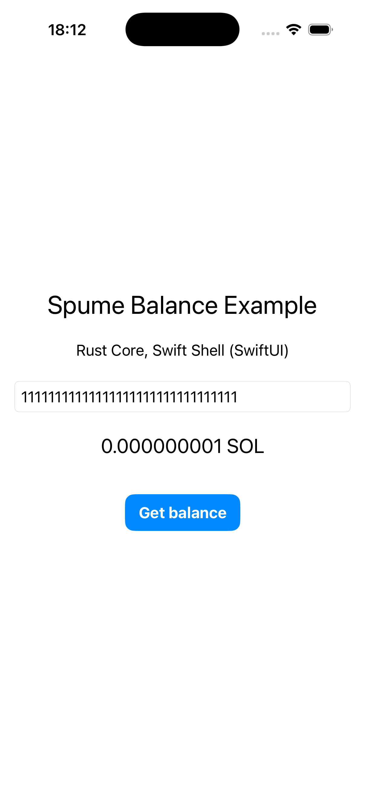
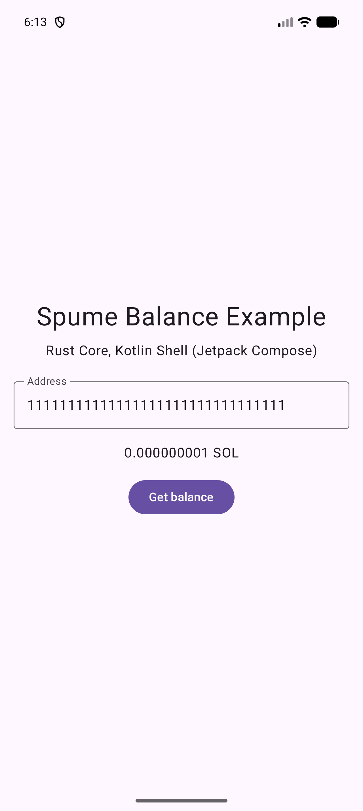

<div align="center">
    
    <p>
        <strong>Lightweight, ergonomic Solana JSON-RPC client for wasm.</strong>
    </p>
    <p>
        <a href="https://github.com/aursen-labs/spume/actions"></a>
        <a href="https://docs.rs/spume"></a>
        <a href="https://opensource.org/licenses/Apache-2.0"></a>
    </p>
</div>

## Install

```bash
cargo add spume                    # HTTP RPC only
cargo add spume --features pubsub  # + WebSocket subscriptions
cargo add spume --no-default-features --features crux,check_address  # Crux HTTP + PubSub

# codec only, bring your own transport
cargo add spume --no-default-features --features check_address
```

The `pubsub` feature is off by default — opt in only if you need WebSocket subscriptions. HTTP-only consumers ship a smaller wasm bundle.

## HTTP usage

```rust
use spume::WasmClient;

let client = WasmClient::new("https://api.mainnet-beta.solana.com");

let slot    = client.get_slot(None).await?;
let version = client.get_version().await?;
let latest  = client.get_latest_blockhash(None).await?;
```

Address-taking methods (e.g. `get_balance`, `get_account_info`) take any `impl CheckAddress` such as `&Address`:

```rust
use solana_address::address;

let owner = address!("11111111111111111111111111111111");
let balance = client.get_balance(&owner, None).await?.value;
```

See [`src/rpc.rs`](src/rpc.rs) for the full list of RPC methods — one table, from which both the client methods and the transport-free builders below are generated.

### Response size limit

HTTP responses are capped at **10 MiB by default** so a misconfigured or
malicious RPC can't OOM the wasm runtime with a multi-gigabyte body. Tune the
limit with `.with_max_response_size(bytes)`:

```rust
// 50 MiB for `getProgramAccounts` on a busy program:
let client = WasmClient::new("https://rpc.example.com")
    .with_max_response_size(50 * 1024 * 1024);
```

The body is read in chunks and the transfer is cancelled as soon as it passes the cap, so an oversized response is never fully buffered. It surfaces as `RpcError::RpcRequestError("response body too large …")`.

## WebSocket / PubSub usage

> Requires the `pubsub` feature.

```rust
use {futures::StreamExt, spume::WasmPubsubClient};

let client = WasmPubsubClient::connect("wss://api.mainnet-beta.solana.com")?;

// Stream of typed notifications:
let mut sub = client.slot_subscribe().await?;
while let Some(info) = sub.next().await {
    let info = info?;          // SlotInfo { slot, parent, root }
    // …
}

// Explicit unsubscribe awaits the server's ack; dropping the subscription
// fires a best-effort unsubscribe instead.
sub.unsubscribe().await?;
```

Supported subscriptions: `account`, `block`, `logs`, `program`, `root`, `signature`, `slot`, `slotsUpdates`, `vote`. See [`src/pubsub_methods.rs`](src/pubsub_methods.rs).

## Crux usage

Enable `crux` with `default-features = false` to use the clients in a native or
WASM Crux core without the browser transports. This feature targets
`crux_core` / `crux_http` 0.20; it is off by default.

```rust
use {
    crux_core::{Command, macros::effect},
    crux_http::HttpRequest,
    futures::StreamExt,
    spume::{CruxClient, CruxPubsubClient, crux::WebSocketRequest},
};

#[effect]
enum Effect {
    Http(HttpRequest),
    WebSocket(WebSocketRequest),
}

enum Event {
    Slot(Result<u64, String>),
}

fn fetch_slot() -> Command<Effect, Event> {
    Command::new(|ctx| async move {
        let client = CruxClient::new("https://api.devnet.solana.com", ctx.clone());
        let slot = client.get_slot(None).await;
        ctx.send_event(Event::Slot(slot.map_err(|e| e.to_string())));
    })
}

fn watch_slots() -> Command<Effect, Event> {
    Command::new(|ctx| async move {
        let client = CruxPubsubClient::new("wss://api.devnet.solana.com", ctx.clone());
        match client.slot_subscribe().await {
            Ok(mut sub) => {
                while let Some(slot) = sub.next().await {
                    ctx.send_event(Event::Slot(slot.map(|s| s.slot).map_err(|e| e.to_string())));
                }
            }
            Err(error) => ctx.send_event(Event::Slot(Err(error.to_string()))),
        }
    })
}
```

The RPC and subscription methods use the same tables and result types as the
WASM clients. `CruxClient` also supports `.with_header(...)`,
`.with_max_response_size(...)`, and `.send(call)` for transport-free builders.

HTTP works with an existing `crux_http` shell handler. WebSockets require a
shell handler for [`WebSocketRequest`](src/crux.rs):

- `Open { id, url, message }`: open a socket keyed by `id`, send the initial
  message after connecting, and repeatedly resolve the request with
  `WebSocketMessage::Text`, `Closed`, or `Error`.
- `Send { id, message }`: send a frame on that socket. Report write failures
  through its original `Open` stream.
- `Close { id }`: close or cancel the socket, even during connection setup.
  `Send` and `Close` are notifications and must not be resolved.

Close the socket if resolving the stream fails. The protocol types derive
Serde and Facet for Crux bridge serialization and type generation.

Each subscription uses its own socket. `.unsubscribe().await` waits for the
server acknowledgement; dropping the subscription closes its socket. A
disconnect yields an error and ends the stream; resubscribe to reconnect.
The shell owns timeouts and download limits. The core additionally rejects
HTTP bodies and WebSocket messages over 10 MiB after they cross the bridge;
this cannot bound the shell's buffer allocation. An oversized notification
yields an error without ending the stream; an oversized message while awaiting
a subscribe/unsubscribe acknowledgement fails that call. Malformed JSON is skipped.

## Bring your own transport (native, tests)

With all features disabled, [`spume::rpc`](src/rpc.rs) exposes the same method
list as the clients, but each method builds a typed call instead of sending it:

```rust
let call = spume::rpc::get_balance(&address, None)?;
let body = call.body(1);
// Send `body` through your own transport, then:
let balance = call.parse(&response_bytes, status)?;
```

[`spume::codec`](src/codec.rs) provides `request_body` and `interpret_body` for
calls not covered by the method table. Opt into `check_address` when disabling
defaults to keep validation of string addresses before requests are built.

## Examples

[`examples/crux-balance`](examples/crux-balance) is a [Crux](https://redbadger.github.io/crux/) core that reads an account balance through `crux_http`, using the optional `CruxClient` described above. Laid out like Crux's own [`counter-http`](https://github.com/redbadger/crux/tree/master/examples/counter-http): a Rust core plus SwiftUI (iOS/macOS) and Jetpack Compose shells.

```bash
cd examples/crux-balance
cargo test -p shared   # the core, no shell and no network needed
just apple/build       # iOS + macOS  (needs boltffi, xcodegen, Xcode)
cd Android && just build   # Android   (needs boltffi, Android SDK/NDK)
```

| iOS (SwiftUI) | Android (Jetpack Compose) |
| --- | --- |
|  |  |

[`examples/leptos-slot-monitor`](examples/leptos-slot-monitor) is a small [Leptos](https://leptos.dev) CSR app that streams the live devnet slot via WebSocket and fetches the node version via HTTP:

```bash
cd examples/leptos-slot-monitor
cargo install trunk
trunk serve --open
```

## Development

```bash
just fmt      # nightly rustfmt
just clippy   # clippy on the native target
just test     # spawn surfpool, run wasm integration tests, tear down
```

The `test` recipe expects [`surfpool`](https://surfpool.run), `wasm-bindgen-cli@0.2.121`, [`just`](https://github.com/casey/just), and Node 22+ in `PATH`. The repo's [`rust-toolchain.toml`](rust-toolchain.toml) auto-installs the stable toolchain with the `wasm32-unknown-unknown` target.

CI runs `fmt`, `clippy`, the native Crux/codec tests, and the wasm test suite on every push; see [`.github/workflows/ci.yml`](.github/workflows/ci.yml).
